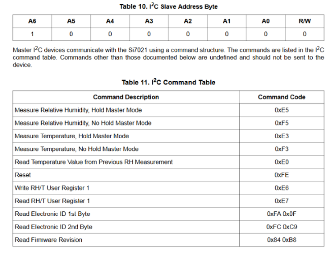
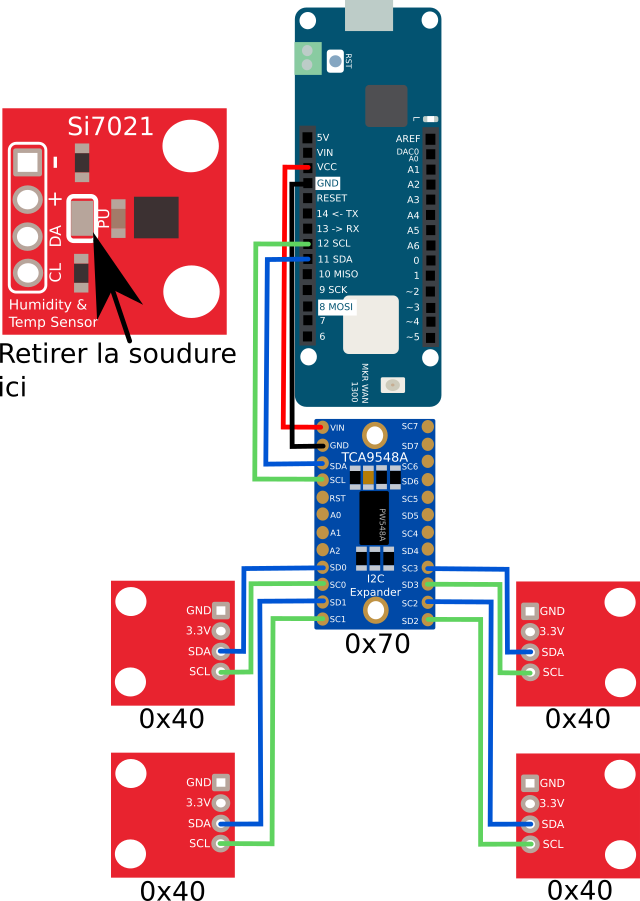

# Si7021

## Protocôle I2C
Le Si7021 communique avec son contrôleur hôte à travers une interface I2C digitale. 
Son adresse esclave 7-bit de base est 0x40. 
Source : [Datasheet](https://cdn.sparkfun.com/assets/learn_tutorials/4/6/7/Si7021Datasheet.pdf) page 18.

Le datasheet ne mentionne pas de méthode pour changer l'adresse I2C. 

## Résistance Pull-Up
Cette plateforme a des résistances pull-up de 4.7KΩ intégrés pour la communication I2C. 
Si vous brancher plusieurs appareils I2C sur le même bus, vous devez **déactiver la résistance** 
Pour les déactiver, enlever la soudure sur le **jumper PU** 

* Source: Hook Up Guide Sparkfun - PullUp Resistors https://learn.sparkfun.com/tutorials/si7021-humidity-and-temperature-sensor-hookup-guide

## Utiliser plusieurs capteurs.
À ma connaissance, la seule méthode pour utiliser plusieurs capteurs I2C avec la même adresse est d'utiliser un multiplexeur I2C. 
Adafruit propose une plateforme avec la puce TCA9548A mais il existe des copies avec la même puce.
* Source: https://learn.adafruit.com/adafruit-tca9548a-1-to-8-i2c-multiplexer-breakout?view=all#pinouts
* Datasheet: http://www.ti.com/lit/ds/symlink/tca9548a.pdf

Adafruit : $6.95 
CJMCU-9548 : $1.52

Voici un schéma (non testé) de branchement de 4 capteurs Si7021 sur un Arduino MKR WAN 1300

Source images - Rémi Sarrailh (CC-0): http://images.madnerd.org/ 